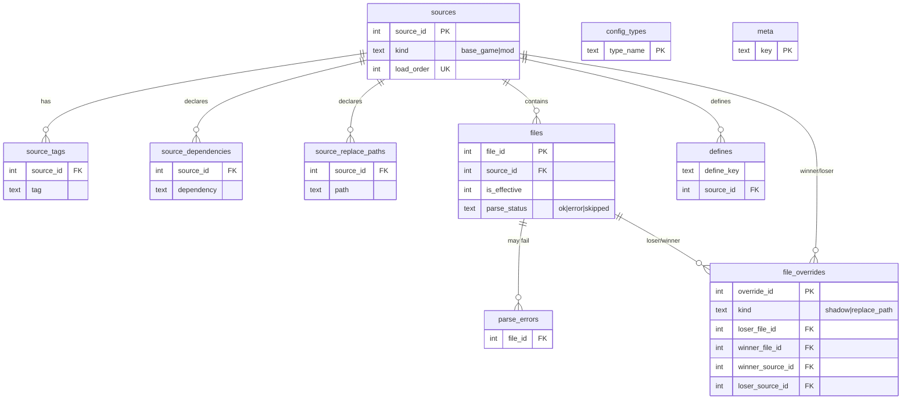
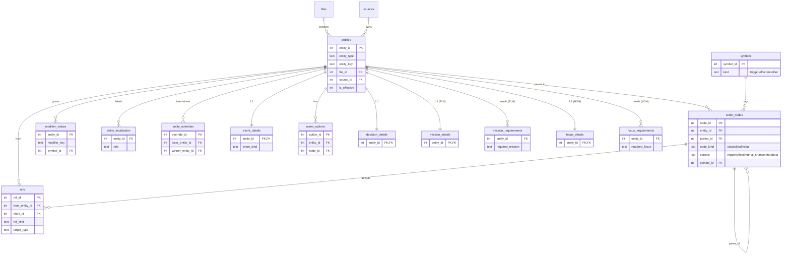
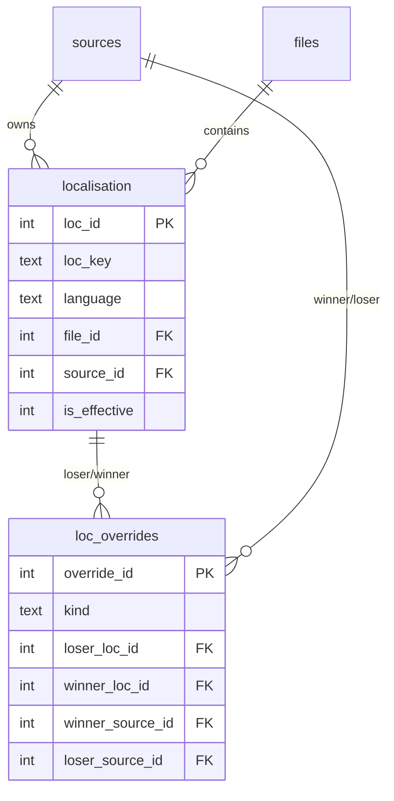

# Database Schema

The index is a single SQLite database (or a mirrored PostgreSQL one). This
document describes the **design philosophy**, the **complete table-and-field
reference**, the override graph, the derived `refs` causal graph, the views, and
full-text search. `Eu4Indexer.Core/Database/Schema.fs` is the authoritative
source for the SQLite DDL; `PostgresSchema.fs` mirrors it table-for-table.

The schema is **mostly shared across games**: every game gets the same core
infrastructure tables, plus a small set of game-specific *detail* tables (EU4:
`mission_*`; HOI4: `focus_*`).

## Design philosophy

The schema is shaped by six recurring decisions. They explain why the tables
look the way they do, and they are worth understanding before writing queries.

1. **Game-agnostic core, per-game detail.** The engine is built around a
   `GameAdapter`, so the infrastructure tables (`sources`, `files`, `entities`,
   `script_nodes`, `refs`, `localisation`, …) carry no game-specific assumptions.
   Anything that *is* game-specific lives in a small set of typed *detail* tables
   keyed 1:1 to `entities` (e.g. `mission_details` for EU4, `focus_details` for
   HOI4). Adding a game means adding adapter code and detail tables, not
   reshaping the core.

2. **Keep the raw tree, derive the graph.** Parsed script is stored twice, at
   two levels of abstraction. `script_nodes` is the **literal** recursive parse
   tree — every clause, leaf, and value exactly as written, with positions. On
   top of that, `refs` is a **derived** cross-reference graph that answers causal
   questions ("what fires event X", "what could reach goal Y"). The raw tree is
   lossless and game-agnostic; the graph is interpreted and the place where game
   semantics are encoded. Keeping them separate means the interpretation can be
   recomputed without re-parsing, and queries can drop to the literal tree when
   the graph doesn't cover a case.

3. **Overrides are recorded explicitly, never silently applied.** Paradox load
   order means later sources shadow or redefine earlier ones. Rather than only
   keeping winners, the index retains the losers (`is_effective = 0`) and records
   *every* override relationship at three levels — file, entity, and
   localisation — naming the winner, the loser, and whether the content was
   identical. This makes "what did this mod change?" a first-class query instead
   of a diff.

4. **Scope-qualified references.** In `refs`, flag/variable targets are
   **scope-qualified** (`country_flag` vs `global_flag` vs `province_flag` vs
   `ruler_flag`). A `has_country_flag` check is therefore never confused with a
   `set_global_flag` set, which is what makes accurate dangling-reference
   detection possible.

5. **Dual-dialect with a version gate.** `Schema.fs` (SQLite) and
   `PostgresSchema.fs` (Postgres) mirror each other column-for-column so the same
   positional INSERTs load both. `PRAGMA user_version` (`Schema.UserVersion`)
   stamps the schema version; the MCP server refuses to serve an index whose
   version doesn't match the binary, so a stale DB fails loudly instead of
   returning wrong shapes.

6. **CJK-friendly text handling.** Non-Latin mods need real work to stay
   searchable: localisation values are run through special-escape decoding and
   markup stripping on the way in, and search uses a trigram tokenizer (SQLite)
   or `pg_trgm` (Postgres) so CJK substrings are findable. See
   [Localisation text handling](#localisation-text-handling) and
   [Full-text search](#full-text-search).

## Versioning and provenance

- `PRAGMA user_version` carries the schema version (`Schema.UserVersion`,
  currently `3`). The MCP server refuses to serve an index whose version doesn't
  match the binary. Any schema change must bump this value.
- The `meta` table holds run provenance as free-form key/value rows: app
  version, game id, indexing timestamp, etc.

## Entity-relationship diagrams

The schema splits into three logical clusters. Each diagram shows only primary
keys plus the key foreign keys and enum columns; the full column list for every
table is in [Table and field reference](#table-and-field-reference) below.

### Cluster A — sources and files



### Cluster B — entities, the script tree, and the reference graph



### Cluster C — localisation



## Table and field reference

Types are the SQLite declared types. Postgres uses the same columns with int4
keys (see [PostgreSQL export](#postgresql-export)). "—" in the constraint column
means the column is nullable with no extra constraint.

### Cluster A — sources and files

#### `meta` — run provenance (key/value, `WITHOUT ROWID`)

| Column | Type | Meaning / constraint |
|---|---|---|
| `key` | TEXT | PRIMARY KEY. Provenance key, e.g. `app_version`, `game_id`, `indexed_at`. |
| `value` | TEXT | NOT NULL. The value for that key. |

#### `sources` — base game + each loaded mod

| Column | Type | Meaning / constraint |
|---|---|---|
| `source_id` | INTEGER | PRIMARY KEY. |
| `kind` | TEXT | NOT NULL, CHECK in (`base_game`, `mod`). |
| `load_order` | INTEGER | NOT NULL, UNIQUE. Resolution order; higher wins. |
| `name` | TEXT | NOT NULL. Display name of the game or mod. |
| `root_path` | TEXT | NOT NULL. Absolute root directory of the source. |
| `descriptor_path` | TEXT | — Path to the mod's `descriptor.mod`, if any. |
| `mod_version` | TEXT | — Mod's self-declared version. |
| `supported_version` | TEXT | — Game version the mod declares support for. |
| `remote_file_id` | TEXT | — Steam Workshop / Paradox Mods file id. |
| `picture` | TEXT | — Thumbnail filename from the descriptor. |

#### `source_tags` — per-source descriptor tags (`WITHOUT ROWID`)

| Column | Type | Meaning / constraint |
|---|---|---|
| `source_id` | INTEGER | NOT NULL, FK → `sources`. Part of PK. |
| `tag` | TEXT | NOT NULL. A descriptor tag (e.g. `Events`). Part of PK. |

#### `source_dependencies` — declared mod dependencies (`WITHOUT ROWID`)

| Column | Type | Meaning / constraint |
|---|---|---|
| `source_id` | INTEGER | NOT NULL, FK → `sources`. Part of PK. |
| `dependency` | TEXT | NOT NULL. Name of a required mod. Part of PK. |

#### `source_replace_paths` — declared `replace_path` directories (`WITHOUT ROWID`)

| Column | Type | Meaning / constraint |
|---|---|---|
| `source_id` | INTEGER | NOT NULL, FK → `sources`. Part of PK. |
| `path` | TEXT | NOT NULL. A directory this mod fully replaces. Part of PK. |

#### `files` — every file from every source

| Column | Type | Meaning / constraint |
|---|---|---|
| `file_id` | INTEGER | PRIMARY KEY. |
| `source_id` | INTEGER | NOT NULL, FK → `sources`. |
| `relative_path` | TEXT | NOT NULL. Path relative to the source root. UNIQUE per `(source_id, relative_path)`. |
| `folder` | TEXT | NOT NULL. The containing directory of the file. |
| `file_name` | TEXT | NOT NULL. The base filename. |
| `content_hash` | TEXT | NOT NULL. Hash of file contents (used for identical-override detection). |
| `byte_size` | INTEGER | NOT NULL. File size in bytes. |
| `is_effective` | INTEGER | NOT NULL, DEFAULT 1. `0` for a shadowed loser kept for provenance. |
| `parse_status` | TEXT | NOT NULL, DEFAULT `ok`, CHECK in (`ok`, `error`, `skipped`). |

#### `parse_errors` — one row per parse failure

| Column | Type | Meaning / constraint |
|---|---|---|
| `file_id` | INTEGER | NOT NULL, FK → `files`. |
| `message` | TEXT | NOT NULL. The parser's error message. |
| `line` | INTEGER | — 1-based line of the failure. |
| `col` | INTEGER | — Column of the failure. |

#### `file_overrides` — file shadow / `replace_path` overrides

| Column | Type | Meaning / constraint |
|---|---|---|
| `override_id` | INTEGER | PRIMARY KEY. |
| `kind` | TEXT | NOT NULL, CHECK in (`shadow`, `replace_path`). |
| `relative_path` | TEXT | NOT NULL. The contested path. |
| `loser_file_id` | INTEGER | NOT NULL, FK → `files`. The shadowed file. |
| `winner_file_id` | INTEGER | — FK → `files`. The winning file (null if removed by `replace_path`). |
| `winner_source_id` | INTEGER | NOT NULL, FK → `sources`. |
| `loser_source_id` | INTEGER | NOT NULL, FK → `sources`. |
| `identical_content` | INTEGER | NOT NULL, DEFAULT 0. `1` if winner and loser bytes are identical. |

#### `config_types` — CWTools `type` definitions driving generic extraction (`WITHOUT ROWID`)

| Column | Type | Meaning / constraint |
|---|---|---|
| `type_name` | TEXT | PRIMARY KEY. The CWTools type name (e.g. `event`, `mission`). |
| `name_field` | TEXT | — Which field supplies the entity key, if not the root key. |
| `paths` | TEXT | NOT NULL. Encoded list of directories this type lives under. |
| `type_per_file` | INTEGER | NOT NULL, DEFAULT 0. `1` if the whole file is a single entity. |
| `skip_root_key` | TEXT | — Root key to descend past before reading entities. |
| `localisation_map` | TEXT | — Encoded role → loc-key-pattern map for this type. |

#### `defines` — game constants per source (`WITHOUT ROWID`)

| Column | Type | Meaning / constraint |
|---|---|---|
| `define_key` | TEXT | NOT NULL. The define name. Part of PK. |
| `value` | TEXT | NOT NULL. Its raw value. |
| `source_id` | INTEGER | NOT NULL, FK → `sources`. Part of PK; later sources win (see `v_effective_defines`). |

### Cluster B — entities, the script tree, and the reference graph

#### `symbols` — trigger/effect/modifier dictionary from the `.cwt` config

| Column | Type | Meaning / constraint |
|---|---|---|
| `symbol_id` | INTEGER | PRIMARY KEY. |
| `name` | TEXT | NOT NULL. The identifier (e.g. `add_stability`). |
| `kind` | TEXT | NOT NULL, CHECK in (`trigger`, `effect`, `modifier`). UNIQUE per `(kind, name)`. |
| `scope` | TEXT | — Scope the symbol applies in, when known. |
| `cwt_file` | TEXT | NOT NULL. The `.cwt` config file that defined it. |

#### `entities` — generic entity table

| Column | Type | Meaning / constraint |
|---|---|---|
| `entity_id` | INTEGER | PRIMARY KEY. |
| `entity_type` | TEXT | NOT NULL. The CWTools type (`event`, `mission`, `decision`, …). |
| `entity_key` | TEXT | NOT NULL. The entity's identifier within its type. |
| `file_id` | INTEGER | NOT NULL, FK → `files`. |
| `source_id` | INTEGER | NOT NULL, FK → `sources`. |
| `start_line` | INTEGER | NOT NULL. First line of the definition. |
| `end_line` | INTEGER | NOT NULL. Last line of the definition. |
| `stmt_index` | INTEGER | NOT NULL. Index of the statement within the file. |
| `subtypes` | TEXT | — Encoded list of CWTools subtypes that matched. |
| `raw_text` | TEXT | NOT NULL. The full original source text of the entity. |
| `is_effective` | INTEGER | NOT NULL, DEFAULT 1. `0` for a redefined/shadowed loser. |

#### `entity_overrides` — entity redefinition / file shadow / `replace_path`

| Column | Type | Meaning / constraint |
|---|---|---|
| `override_id` | INTEGER | PRIMARY KEY. |
| `kind` | TEXT | NOT NULL, CHECK in (`redefinition`, `file_shadow`, `replace_path`). |
| `entity_type` | TEXT | NOT NULL. Type of the contested entity. |
| `entity_key` | TEXT | NOT NULL. Key of the contested entity. |
| `loser_entity_id` | INTEGER | NOT NULL, FK → `entities`. |
| `winner_entity_id` | INTEGER | — FK → `entities`. Null if removed outright. |
| `winner_source_id` | INTEGER | — FK → `sources`. |
| `loser_source_id` | INTEGER | NOT NULL, FK → `sources`. |
| `identical_content` | INTEGER | NOT NULL, DEFAULT 0. |

#### `script_nodes` — the recursive condition/effect tree

| Column | Type | Meaning / constraint |
|---|---|---|
| `node_id` | INTEGER | PRIMARY KEY. |
| `entity_id` | INTEGER | NOT NULL, FK → `entities`. The owning entity. |
| `parent_id` | INTEGER | — FK → `script_nodes`. Null at the entity root; self-reference forms the tree. |
| `depth` | INTEGER | NOT NULL. Nesting depth from the entity root. |
| `sort_order` | INTEGER | NOT NULL. Order among siblings. |
| `node_kind` | TEXT | NOT NULL, CHECK in (`clause`, `leaf`, `value`). |
| `context` | TEXT | NOT NULL, CHECK in (`trigger`, `effect`, `mtth`, `ai_chance`, `metadata`). |
| `key` | TEXT | — Left-hand key of the statement (null for bare values). |
| `operator` | TEXT | — The operator (`=`, `>`, `<`, `>=`, …). |
| `value` | TEXT | — Right-hand value (null for clauses). |
| `value_kind` | TEXT | — CHECK in (`int`, `float`, `bool`, `date`, `string`). |
| `symbol_id` | INTEGER | — FK → `symbols`. Set when the key is a known trigger/effect/modifier. |
| `line` | INTEGER | NOT NULL. Source line of the node. |

#### `modifier_values` — inline modifier `(key → value)` pairs (`WITHOUT ROWID`)

| Column | Type | Meaning / constraint |
|---|---|---|
| `entity_id` | INTEGER | NOT NULL, FK → `entities`. Part of PK. |
| `modifier_key` | TEXT | NOT NULL. The modifier name defined inline in the entity body. Part of PK. |
| `value` | TEXT | NOT NULL. The modifier's value. |
| `symbol_id` | INTEGER | — FK → `symbols`, when the modifier is a known symbol. |

#### `entity_localisation` — entity role → loc key (`WITHOUT ROWID`)

| Column | Type | Meaning / constraint |
|---|---|---|
| `entity_id` | INTEGER | NOT NULL, FK → `entities`. Part of PK. |
| `role` | TEXT | NOT NULL. The slot (`title`, `desc`, …). Part of PK. |
| `loc_key` | TEXT | NOT NULL. The localisation key that fills the slot. |

#### `refs` — the derived causal/cross-reference graph

| Column | Type | Meaning / constraint |
|---|---|---|
| `ref_id` | INTEGER | PRIMARY KEY. |
| `from_entity_id` | INTEGER | NOT NULL, FK → `entities`. The entity making the reference. |
| `from_context` | TEXT | NOT NULL. Where the reference sits: `trigger`/`effect`/`mtth`/`option_trigger`/`option_effect`. |
| `ref_kind` | TEXT | NOT NULL. `fires_event`/`sets_flag`/`checks_flag`/`sets_variable`/`checks_variable`/`applies_modifier`/`checks_modifier`/`calls_scripted_trigger`/`calls_scripted_effect`/`on_action_fires`. |
| `target_type` | TEXT | NOT NULL. Scope-qualified target: `event`/`country_flag`/`global_flag`/`province_flag`/`ruler_flag`/`variable`/`modifier`/`scripted_trigger`/`scripted_effect`. |
| `target_key` | TEXT | NOT NULL. The referenced identifier. |
| `node_id` | INTEGER | NOT NULL, FK → `script_nodes`. The node that makes the reference. |
| `option_node_id` | INTEGER | — FK → `script_nodes`. The enclosing event-option clause, when applicable. |
| `negated` | INTEGER | NOT NULL, DEFAULT 0. `1` when the reference sits inside a `NOT`. |

#### Detail tables — shared

These exist for both games. EU4 and HOI4 differ only in `event_details.event_kind`.

**`event_details`** (1:1 with `entities`)

| Column | Type | Meaning / constraint |
|---|---|---|
| `entity_id` | INTEGER | PRIMARY KEY, FK → `entities`. |
| `namespace` | TEXT | NOT NULL. The event namespace. |
| `event_kind` | TEXT | NOT NULL. **EU4:** CHECK in (`country`, `province`). **HOI4:** CHECK in (`country`, `news`, `state`, `unit_leader`, `operative_leader`). |
| `title_key` | TEXT | — Localisation key of the title. |
| `desc_key` | TEXT | — Localisation key of the description. |
| `picture` | TEXT | — Picture/GFX reference. |
| `is_triggered_only` | INTEGER | NOT NULL, DEFAULT 0. |
| `hidden` | INTEGER | NOT NULL, DEFAULT 0. |
| `fire_only_once` | INTEGER | NOT NULL, DEFAULT 0. |
| `major` | INTEGER | NOT NULL, DEFAULT 0. |
| `has_mtth` | INTEGER | NOT NULL, DEFAULT 0. `1` if the event has a `mean_time_to_happen`. |
| `option_count` | INTEGER | NOT NULL, DEFAULT 0. Number of options. |

**`event_options`**

| Column | Type | Meaning / constraint |
|---|---|---|
| `option_id` | INTEGER | PRIMARY KEY. |
| `entity_id` | INTEGER | NOT NULL, FK → `entities`. UNIQUE per `(entity_id, option_idx)`. |
| `option_idx` | INTEGER | NOT NULL. Order of the option within the event. |
| `name_key` | TEXT | — Localisation key of the option text. |
| `node_id` | INTEGER | NOT NULL, FK → `script_nodes`. The option's clause node. |

**`decision_details`** (1:1 with `entities`)

| Column | Type | Meaning / constraint |
|---|---|---|
| `entity_id` | INTEGER | PRIMARY KEY, FK → `entities`. |
| `major` | INTEGER | NOT NULL, DEFAULT 0. |
| `ai_importance` | REAL | — AI weighting, when present. |

#### Detail tables — EU4 only

**`mission_details`** (1:1 with `entities`)

| Column | Type | Meaning / constraint |
|---|---|---|
| `entity_id` | INTEGER | PRIMARY KEY, FK → `entities`. |
| `series_key` | TEXT | NOT NULL. The mission series/tree the mission belongs to. |
| `slot` | INTEGER | — Column slot in the mission tree. |
| `is_generic` | INTEGER | NOT NULL, DEFAULT 0. |
| `ai` | INTEGER | NOT NULL, DEFAULT 1. Whether the AI pursues it. |
| `icon` | TEXT | — Mission icon. |
| `position` | INTEGER | — Row position in the tree. |
| `has_highlight` | INTEGER | NOT NULL, DEFAULT 0. |

**`mission_requirements`** (`WITHOUT ROWID`)

| Column | Type | Meaning / constraint |
|---|---|---|
| `entity_id` | INTEGER | NOT NULL, FK → `entities`. Part of PK. |
| `required_mission` | TEXT | NOT NULL. A prerequisite mission key. Part of PK. |

#### Detail tables — HOI4 only

**`focus_details`** (1:1 with `entities`)

| Column | Type | Meaning / constraint |
|---|---|---|
| `entity_id` | INTEGER | PRIMARY KEY, FK → `entities`. |
| `tree_id` | TEXT | NOT NULL. The focus tree the focus belongs to. |
| `icon` | TEXT | — Focus icon. |
| `x` | INTEGER | — X grid position. |
| `y` | INTEGER | — Y grid position. |
| `relative_position_id` | TEXT | — Focus this one is positioned relative to. |

**`focus_requirements`** (`WITHOUT ROWID`)

| Column | Type | Meaning / constraint |
|---|---|---|
| `entity_id` | INTEGER | NOT NULL, FK → `entities`. Part of PK. |
| `required_focus` | TEXT | NOT NULL. A prerequisite focus key. Part of PK. |

### Cluster C — localisation

#### `localisation` — every language entry

| Column | Type | Meaning / constraint |
|---|---|---|
| `loc_id` | INTEGER | PRIMARY KEY. |
| `loc_key` | TEXT | NOT NULL. The localisation key. |
| `language` | TEXT | NOT NULL. Language slot (`l_english`, …). |
| `value` | TEXT | NOT NULL. The decoded text (special-escape decoded; see below). |
| `value_plain` | TEXT | NOT NULL, DEFAULT `''`. `value` with inline markup (`§` colour codes, `£` icons) stripped, for search. |
| `version_num` | INTEGER | — The `:N` version number after the key, if any. |
| `file_id` | INTEGER | NOT NULL, FK → `files`. |
| `source_id` | INTEGER | NOT NULL, FK → `sources`. |
| `is_replace` | INTEGER | NOT NULL, DEFAULT 0. `1` if from a `replace/` directory. |
| `is_effective` | INTEGER | NOT NULL, DEFAULT 1. `0` for an overridden entry. |

#### `loc_overrides` — localisation override relationships

| Column | Type | Meaning / constraint |
|---|---|---|
| `override_id` | INTEGER | PRIMARY KEY. |
| `loc_key` | TEXT | NOT NULL. The contested key. |
| `language` | TEXT | NOT NULL. The contested language. |
| `kind` | TEXT | NOT NULL, CHECK in (`later_source`, `replace_dir`, `same_source_duplicate`, `file_shadow`, `replace_path`). |
| `loser_loc_id` | INTEGER | NOT NULL, FK → `localisation`. |
| `winner_loc_id` | INTEGER | — FK → `localisation`. |
| `winner_source_id` | INTEGER | — FK → `sources`. |
| `loser_source_id` | INTEGER | NOT NULL, FK → `sources`. |
| `identical_content` | INTEGER | NOT NULL, DEFAULT 0. |

### Localisation text handling

Two pieces of CJK/markup handling matter for `localisation`:

- **Special-escape decoding.** Non-Latin mods (e.g. Chinese) that hide their text
  in the `l_english` slot using EU4's
  [special-escape](https://gist.github.com/bruceCzK/96ad6e054111f929ed67291552d36334)
  encoding are decoded back to real UTF-8 on the way in; ASCII/Latin text is
  untouched.
- **Markup stripping.** The `value_plain` column holds the value with inline
  formatting markup (`§` colour codes, `£` icons) removed, so colour-split CJK
  text stays searchable. `loc_fts` indexes `value_plain` with the trigram
  tokenizer.

## Override graph at a glance

Override relationships are recorded explicitly at three levels — `file_overrides`,
`entity_overrides`, and `loc_overrides` — each naming the winner and loser (plus
the specific file/entity/loc ids) and an `identical_content` flag. The
`v_override_summary` view unifies all three into `(level, kind, what,
winner_source_id, loser_source_id, identical_content)`.

| Table | Level |
|---|---|
| `file_overrides` | file shadow / `replace_path` |
| `entity_overrides` | entity redefinition / file shadow / `replace_path` |
| `loc_overrides` | localisation later-source / replace-dir / duplicate / shadow |

## Views

| View | Purpose |
|---|---|
| `v_effective_entities` | effective entities (`is_effective = 1`) joined to their source name and relative path. |
| `v_effective_loc` | localisation rows with `is_effective = 1`. |
| `v_effective_defines` | each define resolved to the winning (highest `source_id`) source, with `source_name`. |
| `v_override_summary` | all three override levels unified into `(level, kind, what, winner_source_id, loser_source_id, identical_content)`. |
| `v_modifier_grants` | unifies the two ways an entity grants a modifier: `applied` as an effect (`add_*_modifier = { name = M }`, from `refs`) vs `defined` inline (from `modifier_values`), as `(entity_id, modifier_key, how)`. |

## Full-text search

| FTS table | Over | Tokenizer |
|---|---|---|
| `loc_fts` | `localisation.value_plain` | `trigram` (CJK substrings findable) |
| `entity_fts` | `entities.raw_text` | `unicode61` with `_` as a token char, so identifiers like `set_country_flag` stay whole |

Both are FTS5 external-content tables (`content='localisation'` / `content='entities'`,
`content_rowid` = the primary key), populated after bulk load.

## PostgreSQL export

The Postgres schema (`PostgresSchema.fs`) mirrors the SQLite one table-for-table
and column-for-column, so the same positional INSERTs work. Differences:

- Keys are `INTEGER` (int4) to match the Int32 ids the indexer assigns;
  auto-assigned override/option/ref ids use `GENERATED … AS IDENTITY`.
- Foreign keys are `DEFERRABLE` (checked at commit) to allow the same bulk-load
  insert order as SQLite.
- Full-text search is replaced by `pg_trgm` GIN indexes over `value_plain` and
  `raw_text` — the same CJK substring matching as the SQLite trigram tokenizer
  (`value_plain ILIKE '%幻梦之森%'` stays fast). Skip with `--no-fts` (needs
  `CREATE EXTENSION pg_trgm`).
- On export, only eu4-indexer's own tables are dropped (`CASCADE` removes the
  dependent views) and rebuilt; other objects in the database are untouched.
- The MCP server reads SQLite only; the Postgres export is for your own SQL / BI
  / `pgvector` use.

## Example queries

```sql
-- Events that use the add_stability effect
SELECT DISTINCT e.entity_key
FROM entities e
JOIN script_nodes n ON n.entity_id = e.entity_id
JOIN symbols s ON s.symbol_id = n.symbol_id
WHERE e.entity_type = 'event' AND e.is_effective = 1
  AND s.kind = 'effect' AND s.name = 'add_stability';

-- What did a mod (source_id = 2) override, across all three levels?
SELECT level, kind, what FROM v_override_summary WHERE winner_source_id = 2;

-- Entities whose trigger references the country tag FRA
SELECT DISTINCT e.entity_type, e.entity_key
FROM script_nodes n
JOIN entities e USING (entity_id)
WHERE n.context = 'trigger' AND (n.value = 'FRA' OR (n.key = 'tag' AND n.value = 'FRA'));

-- Everything that fires event 'flavor_eng.1', and what fires it
SELECT from_entity_id, from_context FROM refs
WHERE ref_kind = 'fires_event' AND target_type = 'event' AND target_key = 'flavor_eng.1';

-- Flags checked but never set (candidate dangling references)
SELECT DISTINCT target_type, target_key FROM refs
WHERE ref_kind = 'checks_flag'
  AND target_key NOT IN (SELECT target_key FROM refs WHERE ref_kind = 'sets_flag');
```
